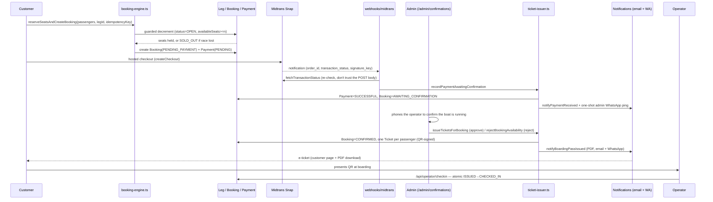

# Booking → payment confirmation → e-ticket

How a seat reservation becomes a boarding pass, end to end. This is a narrative
companion to the file-by-file pointers in `CLAUDE.md`; use that for "which file owns
this," use this for "what actually happens, in order."

## Overview

The flow is a three-stage gate: **reserve → pay → admin confirms → ticket**. The
middle admin step exists because operator capacity isn't guaranteed to stay in sync
with the platform — operators run by phone, not through a dashboard — so an admin
calls the operator to confirm the boat is actually sailing before any boarding pass
goes out. Settling a payment only ever moves a booking to `AWAITING_CONFIRMATION`;
nothing on the payment path is allowed to mint a ticket directly
(`lib/ticket-issuer.ts`, and see `CLAUDE.md`: "never issue a boarding pass straight
from a payment path").

## Sequence

## Stage by stage

### 1. Reservation — `lib/booking-engine.ts`

`reserveSeatsAndCreateBooking(args: CreateBookingArgs): Promise<{ bookingId, bookingReference }>`
is the only entry point that touches seats — reuse it, don't reimplement the race.
Inside one `prisma.$transaction`:

1. **Idempotency replay** — `Booking.idempotencyKey` is unique; a retried request
   returns the existing booking instead of double-booking.
2. **Validation** — loads the `Leg`, checks tenant invariant
   (`leg.operatorId === leg.schedule.boat.operatorId`), `status === OPEN`, not past
   departure, `availableSeats >= seatCount`.
3. **The hold-vs-confirm race** — seats are decremented with a conditionally-guarded
   `tx.leg.updateMany({ where: { id, status: "OPEN", availableSeats: { gte: seatCount } }, data: { decrement } })`.
   `count === 0` means another concurrent booking took the last seats first →
   `SOLD_OUT`. This one guarded update, inside the transaction, is the entire
   overselling defense — no separate seat-hold table, no optimistic-lock retry loop.
4. **Pricing + booking row** — `computeBookingPriceWithTypes`, promo validated and
   applied, `Booking` created as `PENDING_PAYMENT` with a nested `Payment`
   (`PENDING`, placeholder `BANK_TRANSFER` method); `bookingReference` collisions
   (P2002) retried up to 5 times.
5. **Leg → FULL** — flipped via its own guarded `updateMany`
   (`availableSeats: 0, status: OPEN`) so it can't race a concurrent seat release.
6. **Admin alert** — `alertAdminNewBooking` fires *after* commit, un-awaited on
   purpose: a rolled-back reservation shouldn't notify, and a dead WATI/webhook call
   must never fail the booking itself.

`releaseBookingSeats(bookingId, reason)` is the idempotent inverse — increments
`Leg.availableSeats` and reopens it to `OPEN`. Called on expiry, customer
cancellation, and operator rejection.

**Expiry** (`lib/booking-expiry.ts`) is lazy, not cron-driven, for the customer path:
`expireStalePendingBookings()` sweeps `PENDING_PAYMENT` bookings older than
`env.BOOKING_HOLD_MINUTES` on customer-facing reads, rate-limited to once per 30s
in-process. It special-cases PayPal — client-side capture can race the webhook — by
checking `getOrder` before expiring one.

### 2. Pricing — `lib/pricing.ts`

`computeBookingPriceWithTypes({ unitPrice, passengerTypes, commissionRate?, discountAmount?, costBearer?, multipliers?, serviceFee? })`
applies adult/child/infant multipliers; `costBearer` (`PLATFORM` / `OPERATOR` /
`SHARED`) decides who absorbs a promo discount; operator payout is floored at 0; the
service fee is kept entirely by the platform. Invariant that must always hold:
`commissionAmount + operatorAmount === totalAmount`.

### 3. Payment — `lib/midtrans.ts` / `lib/psp.ts`

Midtrans Snap is the live gateway; PayPal (`lib/paypal.ts`) is the fallback.

- `createCheckout(params) → { paymentUrl, orderId, sessionId }` — mock mode when no
  server key is configured.
- `verifyMidtransNotification` — SHA-512 of `order_id + status_code + gross_amount + serverKey`.
  This signature **does not cover `transaction_status`**, so a captured `pending`
  payload could in principle be replayed with a forged `settlement` status — which
  is exactly why the webhook re-fetches the authoritative status from Midtrans
  (`fetchTransactionStatus`) rather than trusting the POST body.
- `nextOrderId` / `bookingReferenceFromOrderId` — a retry-attempt suffix (`~N`)
  scheme, needed because Snap allows a declined `order_id` to be reused and then
  returns 406 at charge time.
- `lib/psp.ts::startMidtransCheckout(bookingReference)` calls `createCheckout` and
  persists `Payment.gatewayReference` / `gatewayProvider`.

The customer-facing shape is: reserve → `/pay/{reference}` → pick a gateway → hosted
page → settle → admin confirms → tickets.

### 4. Webhook → confirmation gate

`app/api/webhooks/midtrans/route.ts`:

1. Verify signature.
2. `readNotification` maps `transaction_status` to `success` / `declined`. Declines
   go through `recordFailedAttempt` — non-terminal, doesn't touch booking status.
   Pending payloads are ack'd without any mutation.
3. On `success`: dedupe via a `WebhookEvent` row (`provider: "midtrans"`), **re-fetch
   transaction status directly from Midtrans**, check amount integrity, then call
   `recordPaymentAwaitingConfirmation` (`lib/ticket-issuer.ts`).

`recordPaymentAwaitingConfirmation(args: { bookingId, paidAt?, gatewayReference?, method?, gatewayFee? }): Promise<PaymentRecordedResult>`
is idempotent — a booking no longer sitting in `PENDING_PAYMENT` returns
`alreadyRecorded: true` and touches nothing. Otherwise it sets
`Payment.status = SUCCESSFUL` and `Booking.status = AWAITING_CONFIRMATION`, and writes
an `AuditLog`. This is the payment→ticket gate: nothing here creates a `Ticket`.

`notifyPaymentReceived` follows — customer gets "we're confirming your seat" (no QR
yet) — and `alertAdminBookingPaid` (`lib/admin-alerts.ts`) fires a one-shot WATI
WhatsApp ping to the on-call admin number, linking to `/admin/confirmations`.

### 5. Admin manual confirmation — `/admin/confirmations`

`app/admin/(authed)/confirmations/page.tsx`, gated by `requireAdmin()` on the page
load and on both server actions. Shows every `AWAITING_CONFIRMATION` booking, soonest
departure first, with the operator's phone/WhatsApp and a note field — the admin's
job is to actually call the operator before clicking anything.

- **Approve** → `issueTicketsForBooking`.
- **Reject** → `rejectBookingAvailability`.

### 6. Ticket issuance — `lib/ticket-issuer.ts`

`issueTicketsForBooking(args: { bookingId, adminId, note? }): Promise<IssueResult>`
(`IssueResult = { bookingReference, tickets, alreadyIssued }`), fully transactional:

- **Idempotent** — if the booking is already `CONFIRMED` with tickets, it just
  returns them (`alreadyIssued: true`); a double-click can't double-mint.
- Otherwise requires `status === AWAITING_CONFIRMATION` (throws if not), parses the
  passenger list out of `Booking.notes`, flips the booking to `CONFIRMED` and stamps
  `availabilityDecidedAt` / `ById` / `Note`, then creates one `Ticket` per passenger
  (`ticketCode` from `newTicketCode`, `qrHash` from `signTicketCode`,
  `status: ISSUED`), and writes an `AuditLog`.
- The caller (`approveAction`) only sends notifications when `!alreadyIssued`.

`rejectBookingAvailability(args: { bookingId, adminId, note? }): Promise<RejectResult>`
mirrors this: `AWAITING_CONFIRMATION → CANCELLED_BY_OPERATOR`, opens a full-value
`Refund` (`PENDING`) in the same transaction, then calls `releaseBookingSeats`
*outside* the transaction (it opens its own). Also idempotent on
`CANCELLED_BY_OPERATOR`.

### 7. QR / ticket codes — `lib/qr.ts` + `lib/references.ts`

- Booking reference: `BK-YYYY-MM-<6char>`. Ticket code: `TK-<tail>-<passengerIndex>`.
- QR payload: `<ticketCode>.<departureYYYY-MM-DD in WITA>.<sig>`, where `sig` is an
  HMAC-SHA256 truncated to 16 bytes, base64url-encoded, keyed by `QR_HMAC_SECRET`.
  Binding the signature to the departure date stops a code from being replayed
  against a different (future) leg even if the code string itself leaked.
- `verifyQrPayload` does a constant-time comparison (`timingSafeEqual`) and returns
  `{ ok, ticketCode, departureYmd }` or a failure reason (`MALFORMED` /
  `BAD_SIGNATURE`). Verification is server-side only.

### 8. E-ticket delivery — `lib/booking-notifications.ts` + `lib/boarding-pass.tsx`

`notifyBoardingPassIssued(bookingId, tickets)` generates the boarding-pass PDF once
(`generateBoardingPassPdf`, react-pdf, one page, a QR per passenger — returns `null`
if `status !== CONFIRMED` or there are no tickets), then fans it out via
`Promise.allSettled` to:

- `sendBookingConfirmation` — email with the PDF attached.
- `sendBoardingPassDocument` / `sendBoardingPassWhatsapp` — WhatsApp document,
  falling back to a link-only message if PDF generation failed.

Every send is best-effort: a failure is logged but never rolls back booking state —
a customer whose WhatsApp bounced still has a confirmed seat.

### 9. Customer view

- `app/(customer)/[locale]/b/[reference]/page.tsx` — renders the QR as an inline
  `` data URL only when `status === CONFIRMED`, plus a link to the boarding-pass
  PDF.
- `app/api/bookings/[reference]/boarding-pass/route.ts` — unauthenticated by
  reference (the 6-char random suffix is the credential); returns 404 unless
  `CONFIRMED`, which is what prevents an early PDF request from leaking a ticket
  before it's actually issued.

### 10. Operator check-in — `app/api/operator/checkin/route.ts`

Re-derives the leg from the DB (never trusts the QR payload's implied leg), checks
operator ownership, leg match, date match, leg status, and ticket status, then
performs an atomic `updateMany({ where: { id, status: "ISSUED" }, data: { status: "CHECKED_IN", ... } })`
so two concurrent scans of the same ticket can't both succeed — the loser falls back
to `ALREADY_CHECKED_IN`.

## State machines

### `Booking.status`

| Status | Set by | Trigger |
|---|---|---|
| `PENDING_PAYMENT` | `reserveSeatsAndCreateBooking` | Seats reserved, payment not yet settled |
| `AWAITING_CONFIRMATION` | `recordPaymentAwaitingConfirmation` | Payment webhook settled |
| `CONFIRMED` | `issueTicketsForBooking` | Admin approves after phoning the operator |
| `CANCELLED_BY_OPERATOR` | `rejectBookingAvailability` | Admin rejects; opens a `Refund`, releases seats |
| `CANCELLED_BY_CUSTOMER` | customer cancellation action | Customer cancels before/while pending |
| `EXPIRED` | `expireStalePendingBookings` | `PENDING_PAYMENT` older than `BOOKING_HOLD_MINUTES` |

### `Payment.status`

`PENDING → SUCCESSFUL` (webhook settles) or `PENDING → FAILED` / `EXPIRED` (decline,
or the booking expires first).

### `Ticket.status`

`ISSUED` (minted by `issueTicketsForBooking`) → `CHECKED_IN` (operator scan) or
`NO_SHOW` / `REFUNDED` (manual/administrative).

## Known gaps

Surfaced while tracing this flow; not fixed here — noted for visibility.

- **Webhook retry cron is stale.** `app/api/cron/retry-webhooks/route.ts` replays
  `WebhookEvent` rows through `lib/webhook-processor.ts::dispatchWebhookPayload`,
  which is written for the old DOKU/Xendit invoice payload shape (`external_id`,
  `status: "PAID" | "EXPIRED"`, `event: "refund.succeeded"`) rather than Midtrans's
  (`order_id`, `transaction_status`, `signature_key`). A retried Midtrans event falls
  through every branch, gets marked `{ ok: true, status: "ignored" }` →
  `WebhookEventStatus.PROCESSED`, and the payment is never actually recorded. Looks
  like leftover code from the DOKU → Midtrans migration that the retry path didn't
  get updated for.
- **No recurring nag for a stuck confirmation.** The only signal an admin gets that a
  booking needs a phone call is the single `alertAdminBookingPaid` WhatsApp ping at
  payment time. If it's missed or muted, nothing re-surfaces the booking except
  someone manually opening `/admin/confirmations` — `app/api/cron/send-reminders/route.ts`
  only handles pre-departure reminders for bookings already `CONFIRMED`.
